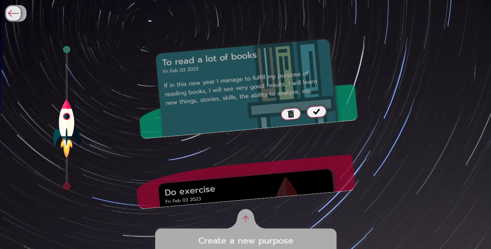

# New Year's Purposes

"New Year Purposes" is a project whose objective is that the user can create a list of his purposes for the new year. The user will be able to create a new purpose with a drop-down form, mark each purpose as completed or incomplete, and when completing all of them the user will receive a surprise.

**Features of use:**

- The data to create the purpose will be name, description, image, and color.
- When creating the purpose, it will be stored in memory.
- Touching the purpose will display more information and options to delete and complete**.**
- The rocket graph represents the number of completed purposes.
- If all the purposes are completed, a celebration will be held.

**Project screenshot:**

<div center>
    
</div>

## Used technologies

*This project has only front-end technologies*

- Reactjs 18
- JavaScript
- Formik
- Framer motion
- Sass

## Commands to run locally

Clone the project

```bash
git clone https://github.com/Anselmo1122/OB-New-year-purposes.git name-directory
```

Go to the project directory

```bash
cd name-directory
```

Install dependencies

```bash
npm install
```

Start the server

```bash
npm start
```
